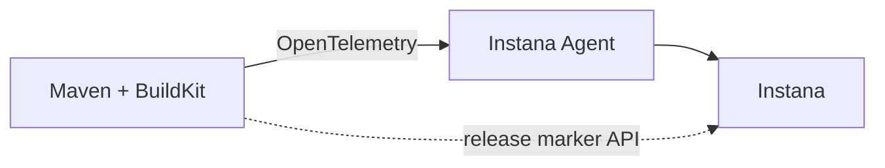

# Using OpenTelemetry for monitoring BuildKit + Maven pipelines



This demo shows a simple example of tracing a Maven and Docker BuildKit pipeline. Maven build execution is declared inside a multi-stage Dockerfile. Docker BuildKit toolkit ([`docker buildx build`](https://docs.docker.com/engine/reference/commandline/buildx_build/)) uses the Dockerfile to build the release image. Both Maven and BuildKit executions are traces by OpenTelemetry with dependency context being propagated from one to the other. 

Traces and metrics are sent to Instana observability platform via an OTLP-enabled Instana agent. The demo also illustrates a DevOps pipeline feedback use-case leveraging the Instana release markers API integration. OpenTlemetry support is provided through readily available plugins/extensions.

The repository provides a quick-to-deploy self-contained Docker-based environment that can be easily integrated with Instana monitoring infrastructure. 

## Run the demo

Clone the demo repository
```sh
git clone https://github.com/styblope/otel-cicd-demo.git
cd cicd/buildkit-maven
```

Create the buildx builder
```sh
EXPORT OTEL_EXPORTER_OTLP_ENDPOINT=http://<Instana or Jaeger OTLP enpoint host>:4317
docker buildx create --name mybuilder \
    --driver-opt "network=host" \
    --driver-opt "env.OTEL_EXPORTER_OTLP_ENDPOINT=$OTEL_EXPORTER_OTLP_ENDPOINT"
```

Run the build
```sh
docker buildx build --builder mybuilder --no-cache --build-args  .
```

Note, the `--no-cache` option is used here to perform a clean build each time we run the build command. Build cache would be normally used in production to significantly cut down the build times.

## Demo requirements
- Linux Host with Docker 18.09+
- Instana agent running on the host with [activated OTLP enpoint](https://www.ibm.com/docs/en/instana-observability/current?topic=apis-opentelemetry#activating-opentelemetry-support)

## Links

[BuildKit OpenTelemetry Support](https://github.com/docker/buildx/blob/master/docs/guides/opentelemetry.md)
[Docker Buildx](https://docs.docker.com/engine/reference/commandline/buildx/)
