# Jenkins + Maven pipeline monitoring with OpenTelemetry and Instana

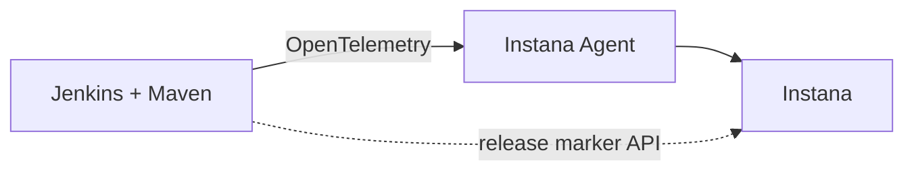

This demo shows an example of OpenTelemetry CI/CD pipeline tracing using Jenkins and Maven. Traces and metrics are sent to Instana observability platform via an OTLP-enabled Instana agent. The demo also illustrates a DevOps pipeline feedback use-case leveraging the Instana release markers API integration. OpenTlemetry support is provided through readily available plugins/extensions.

The repository provides a quick-to-deploy self-contained Docker-based environment that can be easily integrated with Instana monitoring infrastructure. 

You can preview the [demo script](#the-demo-script) in the screencast:

https://user-images.githubusercontent.com/1809272/219722105-cbd7977f-53f4-43a7-87c6-fc64223fb5b2.mp4


## Demo setup

### Demo requirements

- Host with Docker
- Instana agent running on the host with [activated OTLP enpoint](https://www.ibm.com/docs/en/instana-observability/current?topic=apis-opentelemetry#activating-opentelemetry-support)


### Build and deploy Jenkins
Clone the demo repository
```sh
git clone https://github.com/styblope/otel-cicd-demo.git
cd cicd/jenkins-maven
```

Setup sample Java application Git repo
```sh
git clone simple-java-maven-app.git
cd simple-java-maven-app
git remote set-url origin https://github.com/jenkins-docs/simple-java-maven-app.git
cd ..
```

Build and run Jenkins server
```sh
# execute inside `jenkins-maven` directory
docker compose up -d
```

> **Important:*ns``*
> If your Instana backend is **self-hosted** with a self-signed certificate you have to **import the certificate** to the server's Java keystore to allow Instana API access. Copy the certificate as `instana.crt` to the working directory and uncomment the respective section inside the [Dockerfile](./Dockerfile) prior to building the project.

Finish the installation and setup by following the Jenkins tutorial from [this point](https://www.jenkins.io/doc/tutorials/build-a-java-app-with-maven/#accessing-the-jenkins-blue-ocean-docker-container).

To avoid using a separate online source code repository, the demo mounts the sample application source (`simple-java-maven-app`) as a local Git directory inside the Jenkis server container. We'll point to this directory later when configuring the Jenkins pipeline.

### Configure OpenTelemetry plugin for Jenkins
Install the OpenTelemetry plugin via **Dashboard** -> **Manage Jenkins** -> **Manage Plugins** -> **Available plugins** and search for "OpenTelementry".

Configure the plugin by navigating to **Dashboard** -> **Manage Jenkins** -> **Configure System** -> **OpenTelemetry**[^1]:
- Make sure the OTLP Endpoint is set to the host IP where the Instana agent runs.
- Check the "Export OpenTelemetry configuration" as environment variables checkbox. This option is later used by the Maven extension.
- Configure Instana as custom observability backend for quick in-context launch to the Instana trace view. Use the URL template below:

```
https://<your_instana_instance_hostname>/#/analyze;dataSource=traces;tagFilterExpression=!(type~TAG*_FILTER~name~service.name~operator~EQUALS~value~jenkins-pipelines~entity~DESTINATION)~;facets=()~;groupBy=()~;detailId=(traceId~*${traceId}~colorCode~byServiceAndEndpoint)~
```

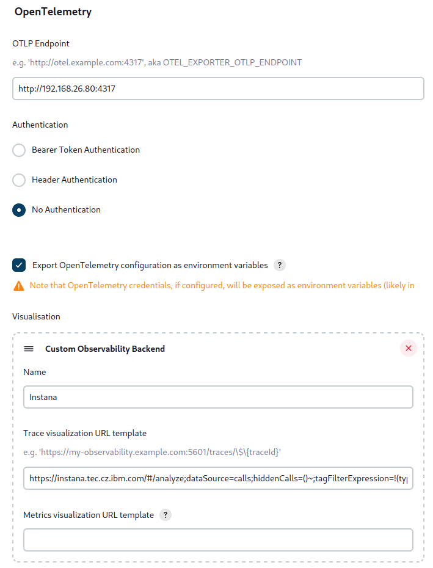

In **Advanced...** options:
- change the **Service name** to `jenkins-pipelines` (this is important for the in-context Instana launch to work correctly).
- add `otel.instrumentation.jenkins.web.enabled=false` in the **Configuration properties** text area to suppress sending traces for the Jenkins server web requests as we are only interested in the pipeline-related traces

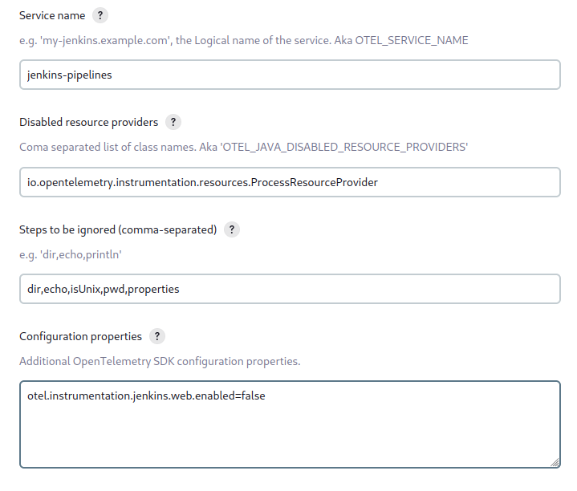

For more details about the Jenkins OpenTelemetry plugin refer to the [plugin documentation](https://plugins.jenkins.io/opentelemetry/)

### Maven OpenTelemetry extension
In order to get application build tracing data from Maven, the [Maven OpenTelemetry extension](https://github.com/open-telemetry/opentelemetry-java-contrib/tree/main/maven-extension) must be declared in the `pom.xml` file that is part of the sample application:
```xml
<project>
  ...
  <build>
    <extensions>
      <extension>
          <groupId>io.opentelemetry.contrib</groupId>
          <artifactId>opentelemetry-maven-extension</artifactId>
          <version>1.10.0-alpha</version>
      </extension>
    </extensions>
  </build>
</project>
```

The XML snippet has already been added and committed in the demo application so no editing is required.
The OTel connection configuration is passed to and picked up by the extension via the exported environment variables (`OTEL_EXPORTER_OTLP_ENDPOINT`) by the Jenkins OpenTelemetry plugin.

### Configure Instana plugin for Jenkins
[The Instana plugin](https://github.com/jenkinsci/instana-plugin) provides you with the possibility to inject [Release Markers](https://www.ibm.com/docs/en/instana-observability/current?topic=capabilities-pipeline-feedback) into Instana. Select and install the plugin followed by a restart of the Jenkins server.

To install the plugin navigate to **Manage Jenkins** -> **Manage Plugins** -> **Available plugins** and search for "Instana". You'll also want to install the "skip-certificate-check" plugin which allows insecure https connections from Jenkins.

Configure the plugin via **Manage Jenkins** -> **Configure System** -> **Instana configuration**[^1]. Enter the Instana backend URL and your Instana API Token.

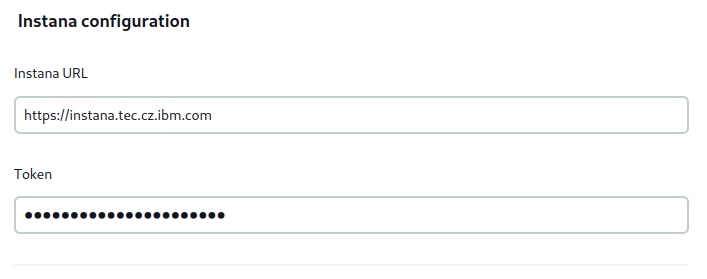

### Create application view in Instana
This step involves creating an application perspective in Instana to group the Jenkins and Maven services into one view.

In Instana web UI, create a new application, e.g. "ci/cd" and use a service filter similar to the one below:


### Create CI/CD pipeline in Jenkins

In the main Jenkins screen, use **New Item** and create a new **Pipeline** named `simple-java-maven-app`. Configure the pipeline script to use the Git SCM and repository URL as `/simple-java-maven-app` as below:

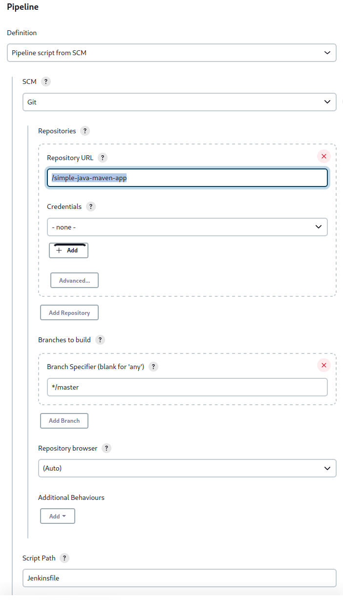

## The demo script

1. Run the pipeline in Jenkins

   **Dashboard** -> **simple-java-maven-app** -> **Build Now**

2. Wait until the pipeline completes 

   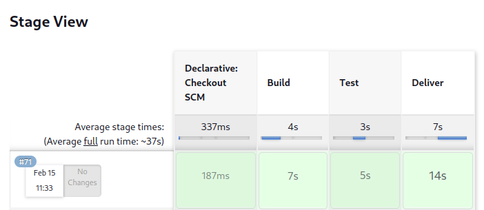

3. Click on the pipeline build number to open the build summary page.

   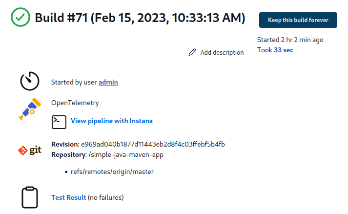 

4. Click on the "View pipeline with Instana" link next to the OpenTelemetry icon.

5. View the build trace in Instana Analytics. The trace shows all the build steps and tasks breakdown. Note the Jenkins and Maven tasks (spans) are correlated together within the trace thanks to context propagation being in place between Jenkins and Maven.
 
   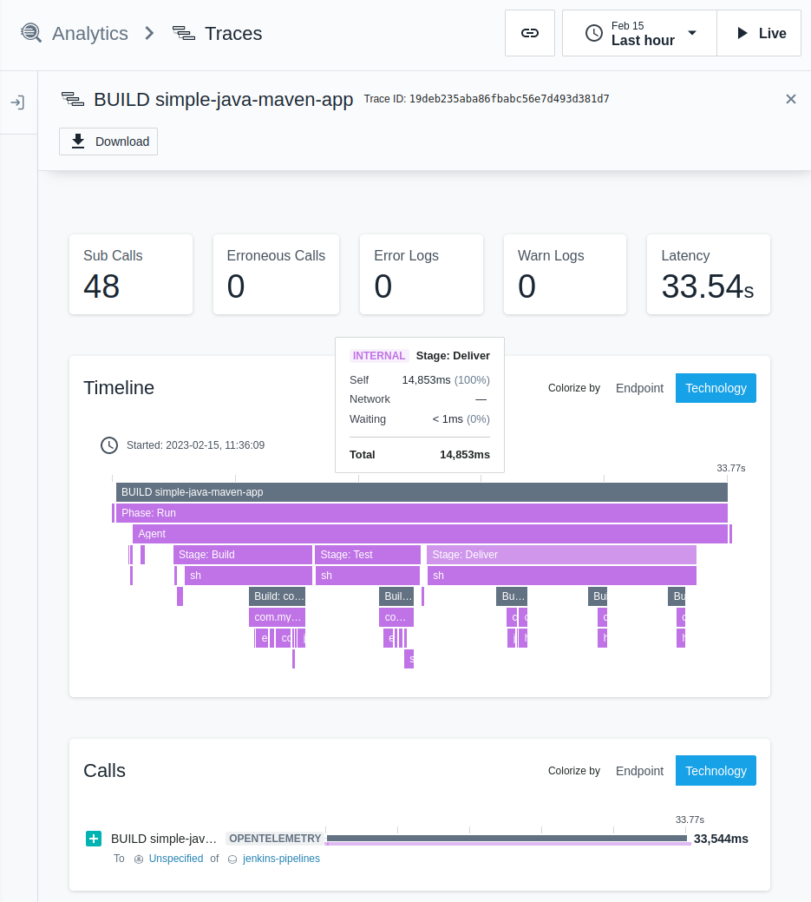

6. Click on the top level "BUILD" span to see the span attributes and correlated infrastructure. The span attributes include additional useful information about the pipeline build.

   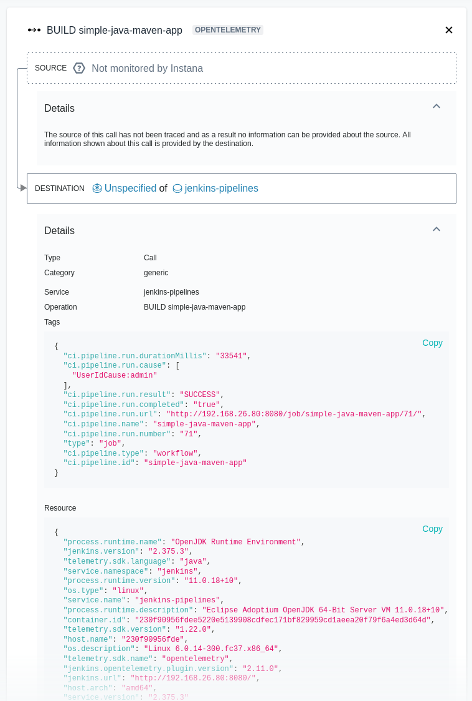

7. With a local Instana host agent, the Jenkins server will appear under Infrastructure (Instana agent auto-detects the Jenkins server).

    

8. Click on the Jenkins link to enter the Instana Jenkins monitoring screen to review the build statistics as observed by Instana.

   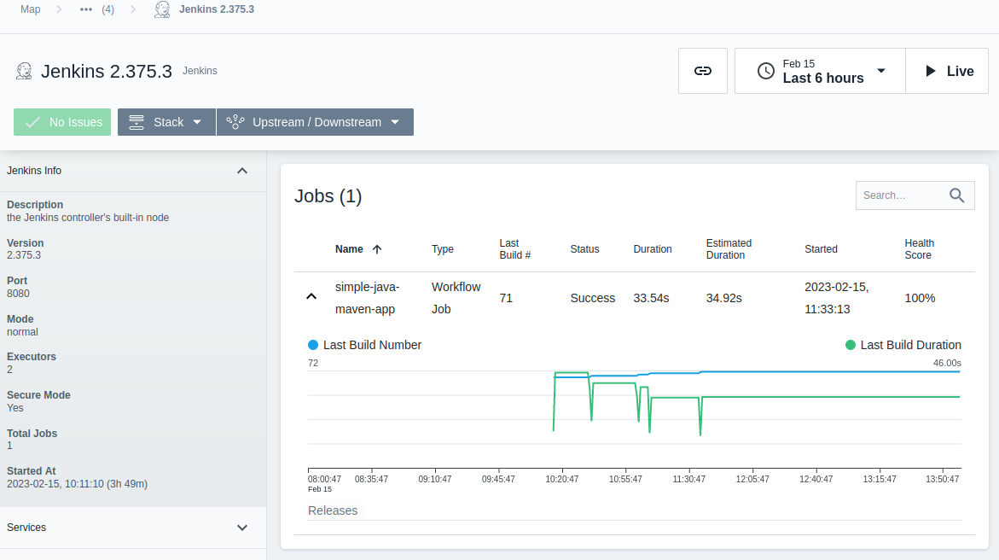

9. Navigate to **Applications** -> **ci/cd** perspective to view the build timeline with release markers injectedi via API by the Jenkins Instana plugin.

   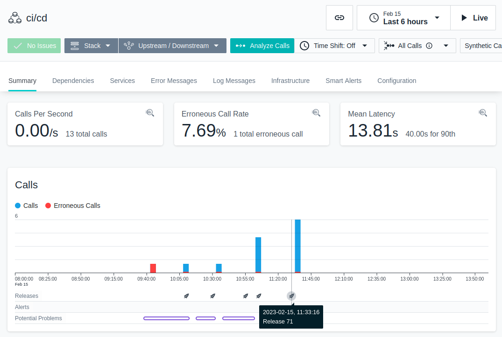 


## Links:
- https://www.jenkins.io/doc/tutorials/build-a-java-app-with-maven/
- https://github.com/jenkins-docs/simple-java-maven-app
- [Jenkins OpenTelemetry Plugin](https://plugins.jenkins.io/opentelemetry/)
- [Maven OpenTelemetry Extension](https://github.com/open-telemetry/opentelemetry-java-contrib/blob/main/maven-extension/README.md)
- [OpenTelemetry Ansible Plugin](https://docs.ansible.com/ansible/latest/collections/community/general/opentelemetry_callback.html)
- [Instana pipeline feedback plugin for Jenkins](https://github.com/jenkinsci/instana-plugin)
- [Instana blog: Monitoring Jenkins Server, Builds, Jobs, and Services](https://www.instana.com/blog/monitoring-jenkins-using-instana/)


[^1]: You can directly navigate to http://<jenkins_host>:8080/manage/configure

